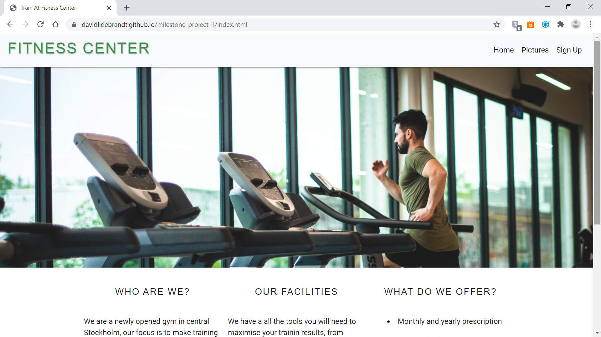

# Milestone Project 1

The project is intended to recruit members to a (fictional) gym. By providing the user with a clear, easily navigated and responsive web page it hopes to attract their attention and liking and make them sign up for a membership.

[Link to the deployed project](https://davidlidebrandt.github.io/milestone-project-1/)

## UX

The goal of the project is to create a responsive and easily navigated site that attracts new members to the gym and provides them with relevant information.

### User Stories

* As a potential member I want easy access to information about what the gym offers.

* As a potential member I want to see images from the gym to get a feel of the environment at the gym.

* As a potential member I want clear and simple instructions on how to become a member.

* As a potential member I want easy access to contact information.

#### Wireframes and Mockups

A few notes on the changes I made from the mockups and wireframes. After consulting with my mentor at Code Institute I decided to change the navigation menu in the header.
I took inspiration from a particular gym's website (see credits) and I also made a few other minor changes to the finished project.

* [Wireframe Mobile](assets/images/wireframes-and-mockups/wireframe-mobile.jpg)
* [Wireframe Tablet](assets/images/wireframes-and-mockups/wireframe-tablet.jpg)
* [Wireframe Desktop](assets/images/wireframes-and-mockups/wireframe-desktop.jpg)

* [Mockup Mobile](assets/images/wireframes-and-mockups/mockup-mobile.jpg)
* [Mockup Tablet](assets/images/wireframes-and-mockups/mockup-tablet.jpg)
* [Mockup Desktop](assets/images/wireframes-and-mockups/mockup-desktop.jpg)
   

## Features

### Existing Features

* An easily accessible navigation bar at the top  that looks the same across all three pages, with which the user can navigate between the pages.
* A footer that looks the same across the pages which hides certain contact information on smaller screns and instead provides a button that links to a modal where the same information can be found.
* A responsive gallery page where the user can scroll down and see images from the gym.
* A sign up form where the user can enter their personal info and sign up for a membership (At this moment the submit button does not actually submit any information).

### Future Features

* Increased functionality in the image gallery page to make it possible to enlarge and view pictures in a separate window.
* Adding videos clips from the gym.
* Connecting the submitted form to a server that receives and registers the information and then sends an email to the user to confirm their membership.
* Adding functionality that requires the "Terms and Conditions" checkbox to be checked before the form can be submitted.

## Technologies Used

* HTML

* CSS

* [Bootstrap](https://getbootstrap.com/)

Bootstrap was used to make the elements in the pages responsive with their container, row, col, d and offset classes.
It was also used for buttons, navbars and modals throughout the project, which both saved time and provided functionality which would have otherwise required the use of custom JavaScript.

As part of the use of Bootstrap a few JavaScript libraries has been included (JQuery, Popper and Bootstraps own JavaScript library).

* [Fontawsome](https://fontawesome.com/)

Fontawsome was used to provide social media and contact icons.

* [Hover.css](https://cdnjs.com/libraries/hover.css)

The hover.css library was used to provide hover effects to the social media icons.

* [Google Fonts](https://fonts.google.com/)

Google fonts was used to import the "Roboto" font which was used throughout the project.

* [Github](https://github.com/)

Github was used to store the repository and to deploy the project

* [Gitpod](https://www.gitpod.io/)

Gitpod was the IDE used to create the project

* [Git](https://git-scm.com/) 

For version control through the gitpod terminal

* [Adobe XD](https://www.adobe.com/products/xd.html)

Adobe XD was used to create the wireframes and mockups for the project

## Testing

Chrome Developer Tool was used throughout the project to check the responsiveness of the pages. Another tool that was used
was the page http://whatismyscreenresolution.net/multi-screen-test, where the page was simulated on a variatey of common devices.  

The project was also run across different web browsers such as Chrome,
Internet Explorer and Microsoft Edge to make sure it looked the way it was intended.

The toggle function of the navbar was tested to make sure it expanded and contracted as expected.

All of the links has been tested to ensure that none are broken, all links to external sites was tested and opens in a new window. 

The form has been tested to make sure it requires a 10 digit number to be entered in the phone number input field
and that a @ sign is included in the e-mail input field.

The CSS code was run through the [WC3 CSS Validator](https://jigsaw.w3.org/css-validator/) without any errors.

The HTML code was run through the [WC3 Markup Validator](https://validator.w3.org/) without any errors.

### User Stories

* As a potential member I want easy access to information about what the gym offers.

The general information about the gym is located on the index page and is responsive and easy to read on different screen sizes.

* As a potential member I want to see images from the gym to get a feel if it is the right choice.

The gallery page is easily accessible from the navbar across the pages, the images are the same size and looks well on different screen sizes.

* As a potential member I want clear and simple instructions how to become a member.

There is a link from the navbar as well as a button located in the index page which leads to the signup page where clear instructions are given how to fill out the form and become a member.

* As a potential member I want easy access to contact information.

All of the contact information is located in the footer which looks the same across the pages. On large screen sizes the contact information is written in the footer. On medium and small screen sizes the information dissappears and instead there is a button to a modal that expands in front of the rest of the screen with the information, which makes it easier to read.

## Deployment

The project was deployed on Github Pages on https://github.com/, the following steps were taken:
1. Went to https://github.com/.
2. Chose the right repsitory on the left side of the page.
3. Clicked on the settings icon.
4. Scrolled down to the Github Pages section
5. Chose the master branch as source and pressed save.
6. Found the link to the deployed project in the Github Pages section after a few minutes.

[Link to the repository](https://github.com/davidlidebrandt/milestone-project-1)   
[Link to the deployed project](https://davidlidebrandt.github.io/milestone-project-1/)

## Credits 

### Content

All of the text was written by the creator of the project.

### Media

All of the images came from [Pexels](https://www.pexels.com/royalty-free-images/)

### Acknowledgments

https://nordicwellness.se/ : For inspiration regarding the navigation bar and some general layout of the page.

Thanks to the mentors and tutors at Code Institute for continuous support throughout the project.